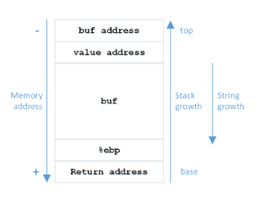

Instituto Superior Técnico, Universidade de Lisboa

**Network and Computer Security**

# Lab guide: Buffer Overflow and Format Strings

## Goals

- Learn how to detect the presence of a buffer-overflow vulnerability.
- Learn how to detect the presence of a format-string vulnerability.
- Learn how to exploit buffer-overflows and format-strings vulnerabilities.
- Learn the existing techniques to protect systems against buffer-overflows.

## Introduction

The goal of this lab is to analyse and exploit buffer-overflow and format string vulnerabilities.
_Buffer-overflow_ vulnerabilities usually occur when someone is allowed to write and/or to execute code in areas that one should not, and usually derives from the usage of unsafe function like `gets`. 
_Format String_ vulnerabilities exist when a program uses `printf(string)` where `string` is a user controlled string.

Modern operating systems and compilers already incorporate some security features that prevent these attacks such as _canaries_, _Executable space protection (XP)/Data Execution Prevention (DEP)_, and _Address Space Layout Randomisation (ASLR)_.

_Canaries_ are known values that are placed between a buffer and control data on the stack to monitor buffer overflows. 
When the buffer overflows, the first data to be corrupted will be the canary, and a failed verification of the canary data is therefore an alert of an overflow; _Executable space protection (XP)_ prevents certain memory sectors, e.g. the stack, from being executed; and _Address Space Layout Randomisation (ASLR)_ is a technology used to help prevent shell-code from being successful. 
It does this by randomly offsetting the location of modules and certain in-memory structures.  

Combining these techniques makes it very difficult to exploit vulnerabilities in applications using shell-code or return-oriented programming (ROP) techniques. 
In order for our attacks to succeed we will thus need to disable them. 
For that we will need to compile our programs using the following flags (we use here `vuln.c` as the program to be compiled, and `vuln` as the generated binary).

__Disable canaries:__ `gcc vuln.c -o vuln -fno-stack-protector`

__Disable XP:__ `gcc vuln.c -o vuln -z execstack`

To disable ASLR we do it for the whole system:

__Disable ASLR:__ `echo 0 | sudo tee /proc/sys/kernel/randomize\_va\_space`

Disable ASLR now as we need it for all our exercises.

The buffer-overflow exercises were adapted from the [Exploit Exercises Project](https://exploit-exercises.com/) namely the [Protostar Project](https://exploit-exercises.com/protostar/).

## Setup

For this Lab you should use the same VM as for XSS and SQLi. 
Instructions on how to setup the lab environment are [here](https://github.com/tecnico-sec/Setup).

You will also use the `gdb` debugger for performing the next set of exercises. 
You may find some helpful pointers below:

- Quick guide to gdb:
  - https://beej.us/guide/bggdb/
  - https://web.stanford.edu/class/cs107/guide/gdb.html
- Graphical plugin for gdb
  - [PEDA - Python Exploit Development Assistance for GDB](https://github.com/longld/peda)
  - [pwndbg](https://github.com/pwndbg/pwndbg)
- Quick guide to shell:
  - http://www.cheat-sheets.org/saved-copy/bash_ref.pdf
  - http://linux-shell-commands.jimdo.com/

## Buffer Overflows

The `store()` function presented below has one local variable: `buf`, a character array with N positions. 
The diagram represents the program stack inside `store()` function, just before jumping to `strcpy()` but after pushing its arguments `value` (the 2nd argument), followed by `buf` (the 1st argument). 
A buffer overflow can happen when `buf` is written beyond its capacity by `strcpy()`, overwriting `$ebp` and the return address. 
This is possible because `strcpy()` does not verify the array bounds.

```C
void store(char* value)
{
   char buf[N];
   strcpy(buf, value);
}
int main(int argc, char** argv)
{
   store(argv[1])
}
```



### Task 1: Warmup

#### 1.1 Simple Overflow

Let us start with program `00-simple.c` (whose compiled binary is `00-simple`). 
The goal of this exercise is to print the message “YOU WIN!!!” in the screen. 
How can we do it?

- Recall how variables are recorded in the stack; can variable `buffer` interfere with variable `control`?
- How many bytes separate the two?
- You might want to use GDB to see where `buffer` and `control` are stored in memory. Below are some of gdb basic functions.

#### GDB Basics

- To analyse a program with gdb type `gdb <file_to_analyse>`
- To disassemble a function use:
 `disassemble <fn_name>` or `disassemble <memory_address>`
  - e.g. `disassemble main` or `disassemble 0x0804843b`.
  - in `gdp-peda` you can use `pdisass <fn_name/address>` to do it with colours.
- `b <memory_address>` inserts a breakpoint
  - eg `b *0x0804846a` or `b *main+47`
- `r` _runs_ the current program
- `c` _continues_ execution until the next breakpoint
- `n` executes the next instrution
- `s` steps into function `fn` when the instruction is a `call fn`
- `p` prints the value of an expression
  - `p variable_name` prints the content of the variable (if the symbol `variable_name` is defined)
  - `p &variable_name` prints the address where the variable is in memory
  - `p *memory_address` prints the content in this address
- `bt` prints a backtrace of the entire stack, that is, shows how you got to the current frame
- `info f` prints the information about the current frame. This is usefull in the case one wants to know where the saved eid (aka, return address) of the frame is stored.
- `stack n` shows the `n` registers of the stack after `esp`.

#### 1.2 Match an Exact Value

Now that you know how to overflow a buffer, can you do it with an exact value? (`01-match.c` and `01-match`).  
The goal of this exercise is to print the “Congratulations” message in the screen.

- Notice that the argument is input in the command line: `./01-match <str to write in buf>;`
- Recall that `0x61626364` is the string `abcd`;
- Are you getting `0xXXYYZZWW` instead of `0xWWZZYYXX`? Recall big and little-endian.

#### 1.3 Calling Functions

Ok, you already know how to overflow a buffer in a controlled way and change variables. 
But can you call a function that is not called anywhere in our code? (`02-functions.c` and `02-functions`). 
The goal of this exercise is to call function `win` and print the “Congratulations” message in the screen.

- Recall that the name of a function in C is the address where this function is written in the memory; you might want to use `objdump -d` to identify the address of `win`, or check it in `gdb`.
- Can `fp` be `win`?


### Task 2: Buffer Overflows

#### 2.1 Change the Return Address

Can you call a function even if NO function is called anywhere in your code? (`03-return.c` and `03-return`)

The goal of this exercise is to call function `win` and print the “Congratulations” message in the screen. Can you do it? Through a buffer overflow attack it is possible to change the return address of a function and thus influence the flow of the execution. How?

- run the program inside gdb. Can you understand what happened? Why is `EIP=0x41414141` in the end of the execution?
- see above the usage of `bt` and `info f` in `gdb`.
- update variable `big_string` accordingly so that you can execute function `win`; compile the new file, and run it.

#### 2.2 Running Code from the Stack

And can you execute code that is not anywhere in your code? 
The program `04-shellcode.c` (and `04-shellcode`) is vulnerable to buffer overflow.

To get used to shellcode, please refer to `test-shellcode-32.c`. 
In this file you have 4 different pieces of shellcode, for executing specific tasks. Uncomment the one you like the most and notice that you can execute this bytecode as a function.

1. prints `hello`
2. `cat /etc/passwd`
3. reboots your machine. Be carefull and save all your open files before running this one!
__Also, when you boot your machine up again, do not forget to disable ASLR again.__
4. pops a new shell with `/bin/sh`. What happens when you run `whoami`?

__Injecting Shell-code__ Now that you have experimented the 4-pieces of shellcode and that you know what they are supposed to do when you have the correct privileges, can you do it in another process? 
Saying it differently, can you execute them without running `./test-shellcode-32`? 
Can you use it using `04-shellcode`?

The goal of this exercise is to inject the shellcode in the stack and force the control flow of the program to jump there. 
Similarly to Task 2.1 you should change the value of the `saved eip` but in this case change it to the address where the variable `buffer` is in memory, rather than the address of function `win`.

Notice that the `attack_string` is given as `argv[1]` so you should run your code as

```bash
./04-shellcode $(python -c 'print(attack_string)')
```

- Notice that the position of the `buffer` depends on the length of `attack_string`. 
Identify what is the supposed length of the `attack_string` and the address of the `buffer` should then be fixed.
- Were you able to spawn a new shell? What happens when you type `whoami`?
- Change now the permissions and ownership of the file

```bash
sudo chown root:root 04-shellcode
sudo chmod 4755 04-shellcode
```

- What happens when you run the attack and ask `whoami`? Why is it different?

#### 2.3 Running Code from Environment Variables

Sometimes the buffer does not have enough space to put the entire shell code there. 
The `05-environment.c` program is an example of that where we reduced the buffer size of `04-shellcode.c` from 100 to 5.

In this case it is possible to exploit buffer overflow running the shell code in memory positions where the environmental variables are placed.

- Create an environmental variable with the code you want to execute. 
The easiest way is to do is:
  - `export SHELLCODE=$(python -c 'print(shellcode)')`
  - check by doing `echo $SHELLCODE`
- Run `05-environment` in gdb and see where the environment variable is.
  - either use `stack N` or `x/Ns $esp` for some number `N`
- Have in mind the name of the environmental variable to calculate the actual address where the shell code begins. This address is to be used as the return address.

Your attack should now be

```bash
./05-environment $(python -c 'print(attack_string)')
```

### Task 3: Format Strings

It is possible to explore a program that makes use of `printf(string)` where `string` is a user controlled string.

The idea is very simple. 
Whenever function `printf` is called, the caller function pushes to the stack the format string plus 1 argument for each `%` that is included in the format string. 
The `printf` function then prints these in order starting from the one immediately below the format string. 
What happens when these extra arguments are not pushed to the stack? 
`printf` will behave the same way but in this case it will print the values that were already in the stack.

For this lab we propose a series of simple exercises `0-read.c` to `4-return.c`. 
These go from simply reading values from the stack, to change return addresses and redirect control-flow using the format string vulnerability.

Notice that these files do not need to be compiled with `-fno-stack-protector` nor `-z execstack` but you need to disable the ASLR for all of them (this is a global setting for the OS).

```bash
echo 0 | sudo tee /proc/sys/kernel/randomize_va_space
```

Compilation info is at the header of each source file.

#### 3.1 Read Arbitrary Memory

Start with exercise [`06.read.c`](06-read.c). 
Compile it and notice that in this case you cannot do a buffer overflow as `buffer` is located __below__ the other variables. 
In fact `secret_message` is even in a different memory segment.

- Can you still read `secret_number`?
- And `secret_message`?

The `printf`s are there just to help you and you should be able to get these values in some other way.

The idea is to ask for `%x` without pushing the corresponding arguments to the stack.

- What happens when you send `AAAA.%08x.%08x.%08x.%08x.%08x.%08x.%08x.%08x.%08x.%08x.%08x.%08x.%08x.%08x.%08x.%08x.%08x.%08x.%08x.%08x`?
  - We used `%08x` to print the values in hex and padded with `0`'s to the left to use 8 characters.
  - We used `.` to separate the printed registers.
  - Both are just to make the result more readable.
- Do you see `41414141`? What does it mean? `41414141` is the `AAAA` that we have introduced at the beginning of our string. This means that the 11th register on the stack is the beginning of `buffer` and is controled by us.
- The register before the `buffer` is our `secret_number`. How can you read its value? Recall that (decimal) numbers are printed with `%d`.
- And how can you read `secret_message`? Recall that you control the beginning of the buffer, you know the address where `secret_message` is, and `%s` prints the string that is in a given memory address.

#### 3.2 Read Arbitrary Memory with a small buffer

And if you have a shorter buffer of 12-bytes? 
Can you still read ___both___ these values? 
Try it with [`07-short-read.c`](07-short-read.c)

- Recall that `%N$x` accesses the `N+1`th parameter of `printf` and prints it as hex.

#### 3.3 Write Arbitrary Memory

Function `printf` also allows you to write on variables using the format string `%n` (and similarly to before `%N$n`).

- Can you change the value of `integrity_number` in [`08-write.c`](08-write.c)?
- Can you change it to `100`?
- Can you change the `integrity_message` to `A`?

#### 3.4 Write Arbitrary Memory. Calling Functions

[`09-functions.c`](09-functions.c) looks like buffer-overflow again but in this case `buffer` is located __below__ `fp`. 
Can you still win the game?

- You might need to write one byte at a time. Consider using `%hhn` instead of `%n` for writing a single byte.

#### 3.5 Write Arbitrary Memory. Change the return address

And what about [`10-return.c`](10-return.c)? 
Can you still win the game **even** with stack protection enabled?


**Acknowledgments**

Original version: Pedro Adão

----

[SIRS Faculty](mailto:meic-sirs@disciplinas.tecnico.ulisboa.pt)
